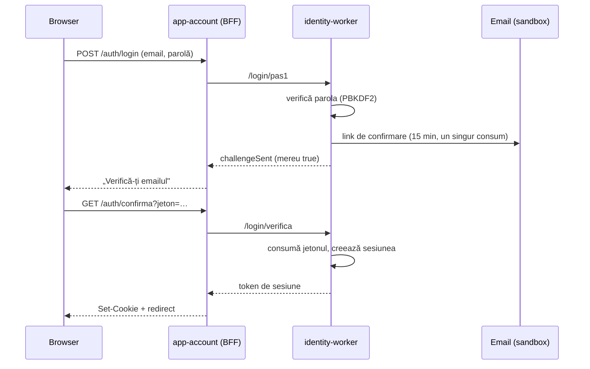

# Identitate, sesiuni și SSO

## Fluxul de autentificare

Autentificarea are **doi factori, la fiecare login**, fără excepții și fără „ține minte
dispozitivul":

1. **ce știi** — email + parolă;
2. **ce controlezi** — un link de confirmare trimis pe adresa respectivă.

Sesiunea se naște abia la pasul 2. Pasul 1 nu creează nimic durabil în afară de un jeton de
confirmare cu viață scurtă.

## De ce link și nu cod din 6 cifre

Decizia utilizatorului (10.09.2026): linkul e mai ușor de folosit pe telefon — o apăsare, fără
comutat între aplicații și fără transcris cifre. Costul e că linkul trebuie să fie
single-use și scurt ca durată, ceea ce e implementat: consum atomic (`UPDATE … WHERE consumed_at
IS NULL`), 15 minute de viață, și invalidarea jetoanelor anterioare la emiterea unuia nou.

## Ce se stochează

| Element | Cum |
|---|---|
| Parolă | PBKDF2-HMAC-SHA256, 210.000 iterații, sare per utilizator; parametrii sunt scriși în hash, ca să poată fi crescuți fără invalidare |
| Jeton de sesiune | aleator, 32 de octeți; în baza de date **doar** SHA-256 al lui |
| Jeton de confirmare | identic ca tratament — hash, expirare, consum unic |
| PII | doar email și nume afișat. Fără telefon, adresă, date personale |

O scurgere a bazei nu dă nici parole utilizabile, nici sesiuni active.

## Cookie-uri

| Atribut | Valoare | De ce |
|---|---|---|
| `HttpOnly` | da | JS-ul paginii nu trebuie să atingă sesiunea |
| `Secure` | da | doar HTTPS |
| `SameSite` | `Lax` | permite navigarea normală, blochează POST-uri din alte origini |
| `Path` | `/` | |
| `Domain` | gol în dev, `.staging.sfantul-ilie.ro` în staging | SSO pe subdomeniile mediului |

În dev, gazda `rubik` nu are punct în nume, iar un cookie nu poate avea `Domain` acolo — de aceea
cookie-ul e host-only și SSO-ul se vede prin gateway, pe același host.

**Cookie-ul de staging nu are voie să fie pe `.sfantul-ilie.ro`.** Ar fi trimis și către
aplicațiile V1 de pe subdomeniile de producție.

## Amenințări și ce le oprește

| Amenințare | Măsură |
|---|---|
| Enumerarea conturilor | răspuns identic la email inexistent / parolă greșită, plus cost artificial de timp (`consumaTimpDegeaba`) |
| Forță brută pe parolă | limitare pe email (8/15 min) și pe IP (30/15 min), în ferestre glisante |
| CSRF | verificare de `Origin` **și** jeton pereche cookie/formular, comparat în timp constant |
| Refolosirea linkului | consum atomic, o singură dată |
| Sesiune furată | durată 12 h, revocare centrală („închide toate sesiunile"), rotație la fiecare login |
| Scurgere prin loguri | logger cu redactare obligatorie; nu există cale de a scrie un obiect ne-redactat |

## Ce nu e implementat încă

- **OIDC** — nu e nevoie cât timp toate aplicațiile sunt ale noastre, pe subdomenii proprii. Se
  adaugă când apare o aplicație mobilă sau un terț.
- **Resetare de parolă** — tabela există, fluxul nu. Se adaugă odată cu emailul real; până atunci
  resetarea ar fi oricum netestabilă.
- **Livrare reală de email** — vezi `docs/runbooks/email-real.md`.
