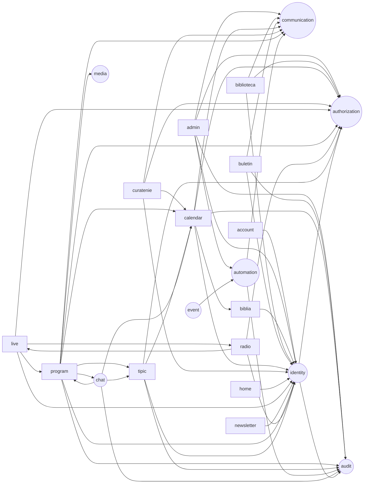

# Schema platformei in termeni Cloudflare — production

> Generat din `wrangler.jsonc` cu `node infrastructure/cutover/schema-cloud.mjs` (2026-09-14).
> Nu se scrie de mana: se regenereaza dupa orice schimbare de legaturi sau resurse.

## La nivel de platforma

Fiecare aplicatie e un **Worker** separat, cu datele ei. Browserul vorbeste DOAR cu aplicatia de pe
subdomeniul lui; aplicatia e BFF-ul: ea cheama serviciile prin **Service Bindings** (chemare interna,
fara internet, fara DNS, fara CORS). Nimeni nu citeste baza altcuiva.

Trei straturi:

1. **Aplicatiile** (`apps/`) — au adresa publica si paginile. Proprietare pe domeniul lor.
2. **Serviciile** (`services/`) — n-au adresa publica: identitate, autorizare, audit, comunicare,
   evenimente, automatizare, media, chat. Se ajunge la ele numai prin Service Binding.
3. **Resursele** — D1 (baze), R2 (depozite), KV (comutatoare), Queues (evenimente),
   Durable Objects (starea vie a emisiei), Workers AI + AI Gateway (chatul), Browser Rendering (hartii).

## Aplicatie cu aplicatie

### account — `xc-account-production`
- **Adresa**: — (inca fara Custom Domain)
- **Cheama**: identity

### admin — `xc-admin-production`
- **Adresa**: — (inca fara Custom Domain)
- **KV**: CONFIG
- **Cheama**: identity, authorization, audit, automation, communication

### biblia — `xc-biblia-production`
- **Adresa**: — (inca fara Custom Domain)
- **R2**: xc-biblia-production
- **Cheama**: identity
- **Chemat de**: calendar

### biblioteca — `xc-biblioteca-production`
- **Adresa**: — (inca fara Custom Domain)
- **D1**: xc-biblioteca-production
- **R2**: xc-biblioteca-production
- **Cron**: 0 6 * * *
- **Cheama**: identity, authorization, communication

### buletin — `xc-buletin-production`
- **Adresa**: — (inca fara Custom Domain)
- **D1**: xc-buletin-production
- **R2**: xc-buletin-production
- **Cheama**: identity, audit, communication

### calendar — `xc-calendar-production`
- **Adresa**: — (inca fara Custom Domain)
- **D1**: xc-calendar-production
- **Queues**: xc-events-production (scrie)
- **Cron**: */5 * * * *
- **Browser Rendering**
- **Cheama**: identity, authorization, audit, communication, biblia
- **Chemat de**: curatenie, program, tipic, chat

### curatenie — `xc-curatenie-production`
- **Adresa**: — (inca fara Custom Domain)
- **D1**: xc-curatenie-production
- **Cron**: 0 * * * *
- **Cheama**: identity, authorization, communication, calendar

### home — `xc-home-production`
- **Adresa**: — (inca fara Custom Domain)
- **Cheama**: identity

### live — `xc-live-production`
- **Adresa**: — (inca fara Custom Domain)
- **Durable Objects**: Direct, Aparat, Ascultatori
- **Cheama**: identity, authorization, radio, program
- **Chemat de**: radio

### newsletter — `xc-newsletter-production`
- **Adresa**: — (inca fara Custom Domain)
- **R2**: xc-newsletter-production
- **Cheama**: identity

### program — `xc-program-production`
- **Adresa**: — (inca fara Custom Domain)
- **D1**: xc-program-production
- **KV**: CONFIG
- **Queues**: xc-events-production (scrie)
- **Cron**: */5 * * * *
- **Browser Rendering**
- **Cheama**: identity, authorization, audit, calendar, tipic, communication, media, chat
- **Chemat de**: live, chat

### radio — `xc-radio-production`
- **Adresa**: — (inca fara Custom Domain)
- **R2**: biserica-transmisiuni
- **Durable Objects**: Radio
- **Cheama**: identity, authorization, live
- **Chemat de**: live

### tipic — `xc-tipic-production`
- **Adresa**: — (inca fara Custom Domain)
- **D1**: xc-tipic-production
- **R2**: xc-tipic-production
- **Cheama**: identity, authorization, audit, calendar
- **Chemat de**: program, chat

### audit — `xc-audit-production` *(serviciu intern)*
- **D1**: xc-audit-production
- **Cheama**: pe nimeni
- **Chemat de**: admin, buletin, calendar, program, tipic, automation, chat, identity

### authorization — `xc-authz-production` *(serviciu intern)*
- **D1**: xc-authz-production
- **Cheama**: pe nimeni
- **Chemat de**: admin, biblioteca, calendar, curatenie, live, program, radio, tipic, identity

### automation — `xc-automation-production` *(serviciu intern)*
- **D1**: xc-automation-production
- **Cheama**: communication, audit
- **Chemat de**: admin, event

### chat — `xc-chat-production` *(serviciu intern)*
- **D1**: xc-chat-production
- **KV**: CONFIG
- **Workers AI** (prin AI Gateway)
- **Cheama**: program, calendar, tipic, audit
- **Chemat de**: program

### communication — `xc-communication-production` *(serviciu intern)*
- **D1**: xc-communication-production
- **Cheama**: pe nimeni
- **Chemat de**: admin, biblioteca, buletin, calendar, curatenie, program, automation

### event — `xc-events-production` *(serviciu intern)*
- **D1**: xc-audit-production
- **Queues**: xc-events-production (citeste)
- **Cheama**: automation

### identity — `xc-identity-production` *(serviciu intern)*
- **D1**: xc-identity-production
- **Cheama**: authorization, audit
- **Chemat de**: account, admin, biblia, biblioteca, buletin, calendar, curatenie, home, live, newsletter, program, radio, tipic

### media — `xc-media-production` *(serviciu intern)*
- **R2**: xc-media-production
- **Cheama**: pe nimeni
- **Chemat de**: program

## Socoteala

- 13 aplicatii + 8 servicii = 21 Workers
- 12 baze D1, 7 depozite R2,
  1 spatiu KV, 1 cozi
- 4 workeri cu ceas (cron), 2 cu Durable Objects

