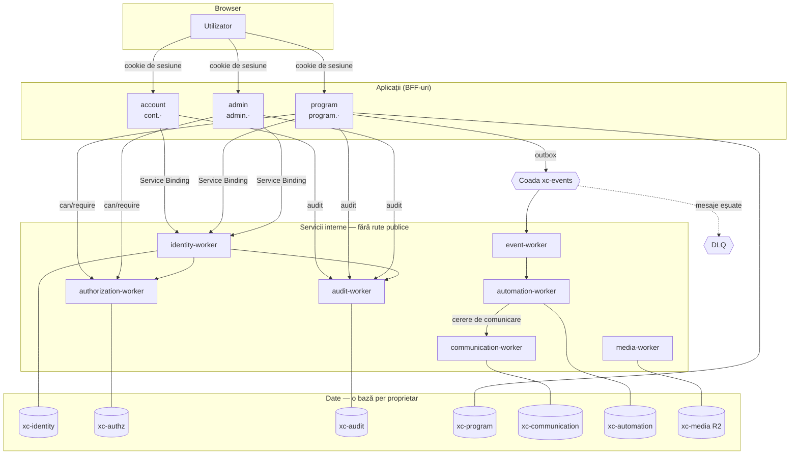

# Arhitectura V2 — vedere de ansamblu

## Principiul care ține totul

Fiecare domeniu are **un singur proprietar** și **o singură bază**. Aplicațiile nu se ating între
ele: vorbesc prin contracte tipate (Service Bindings, sincron) sau prin evenimente versionate
(cozi, asincron). Codul comun stă într-un singur loc, nu copiat în fiecare aplicație — exact
problema care a făcut V1 imposibil de scalat.

## Componentele

## Reguli de limită

1. **Browserul nu vorbește niciodată cu un serviciu intern.** Aplicațiile sunt BFF-uri: primesc
   cookie-ul, verifică sesiunea intern, răspund cu HTML.
2. **Nicio aplicație nu citește baza alteia.** Nu există binding încrucișat — se vede direct în
   fișierele `wrangler.jsonc`.
3. **Autorizarea nu se face local.** Nicăieri în aplicații nu există `rol === 'admin'`; toate
   întreabă `authorization-worker`, iar indisponibilitatea lui înseamnă refuz, nu permisiune.
4. **Automatizarea nu e un dispecer central.** Ea declanșează și cere; logica de domeniu rămâne
   la proprietar. `automation-worker` nu scrie niciodată în baza calendarului.
5. **Un singur serviciu poate livra mesaje** — `communication-worker`. Aplicațiile emit o cerere
   și atât; ele nu ating liste de destinatari și nu cunosc furnizorii.

## Gateway-ul

`apps/gateway` există **numai pentru preview local**, unde containerul are un singur port. El
mapează căi (`/program`, `/admin`, restul) către aplicații. În staging și producție nu se
folosește: fiecare aplicație are subdomeniul ei, iar SSO-ul vine din cookie-ul pe domeniul părinte.
